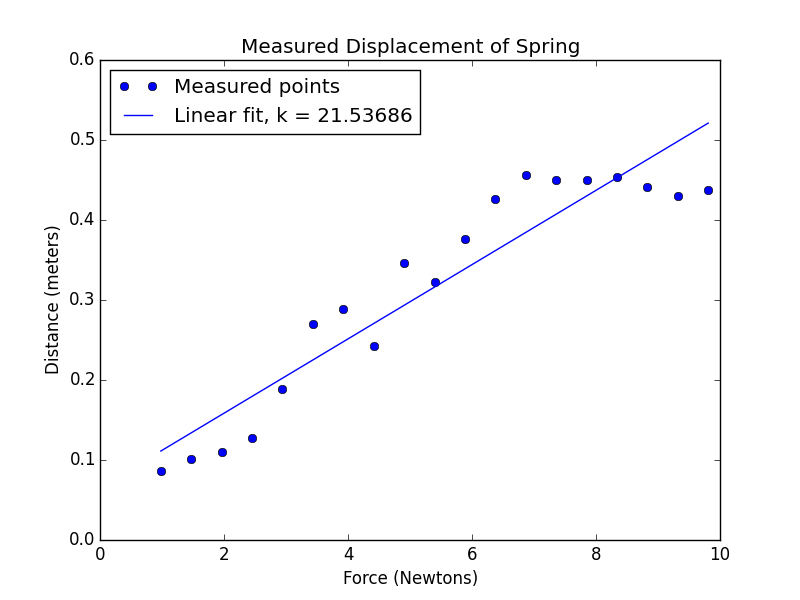
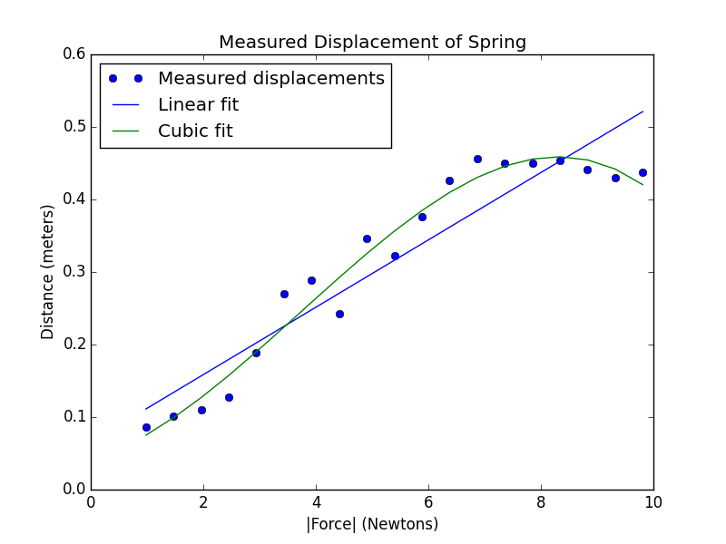
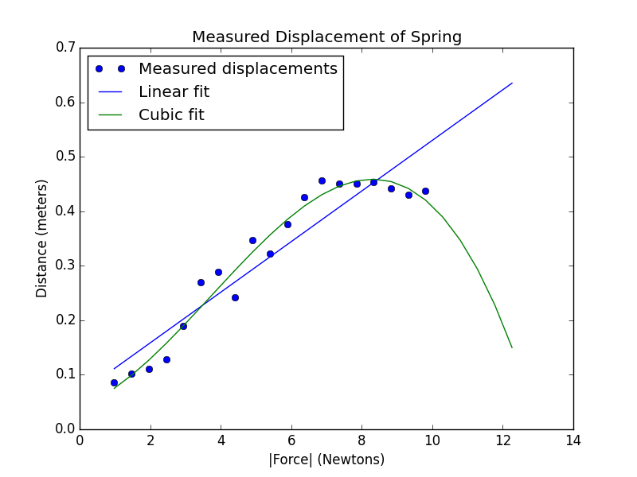
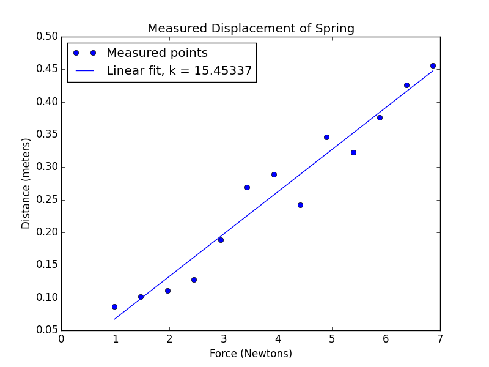

**let's use polyfit to find the line that best fits our data.
**
```python
import pylab, random

def getData(fileName):
    dataFile = open(fileName, 'r')
    distances = []
    masses = []
    discardHeader = dataFile.readline()
    for line in dataFile:
        d, m = line.split()
        distances.append(float(d))
        masses.append(float(m))
    dataFile.close()
    return (masses, distances)

def fitData(fileName):
    xVals, yVals = getData(fileName)
    xVals = pylab.array(xVals)
    yVals = pylab.array(yVals)
    xVals = xVals*9.81  # convert mass to force (F = mg)
    pylab.plot(xVals, yVals, 'bo', label = 'Measured points')
    pylab.title('Measured Displacement of Spring')
    pylab.xlabel('Force (Newtons)')
    pylab.ylabel('Distance (meters)')
    a,b = pylab.polyfit(xVals, yVals, 1)  # fit y = ax + b
    # use line equation to graph predicted values
    estYVals = a*xVals + b
    k = 1/a
    pylab.plot(xVals, estYVals, label = 'Linear fit, k = '
               + str(round(k, 5)))
    pylab.legend(loc = 'best')

fitData('springData.txt')
pylab.show()
```
This procedure is just like **plotData** except that we've added a call to polyfit in which we give it the forces and the observed extensions and ask it to find the equations of the line so that the predictions best fit the observations.

Then we go off and use those parameters to make a bunch of estimates for what the y value should be, the extension should be

If we run that the result would be:



But it doesn't look like the best fit!

Maybe there's a different curve here that would actually fit the observed points better.

let's try to invent Terman's law. So what Terman's law is, in fact? It says that there's a cubic relationship between the force that's supplied and extension, rather than a linear relationship.

Here I have a new procedure, fitData1 which uses polyfit to fit a cubic equation to the observed data.

```python
def fitData1(fileName):
    xVals, yVals = getData(fileName)
    xVals = pylab.array(xVals)
    yVals = pylab.array(yVals)
    xVals = xVals*9.81  # convert mass to force (F = mg)
    pylab.plot(xVals, yVals, 'bo', label = 'Measured displacements')
    pylab.title('Measured Displacement of Spring')
    pylab.xlabel('|Force| (Newtons)')
    pylab.ylabel('Distance (meters)')
    a,b = pylab.polyfit(xVals, yVals, 1)
    estYVals = a*xVals + b
    pylab.plot(xVals, estYVals, label = 'Linear fit')
    a,b,c,d = pylab.polyfit(xVals, yVals, 3)
    estYVals = a*(xVals**3) + b*xVals**2 + c*xVals + d
    pylab.plot(xVals, estYVals, label = 'Cubic fit')
    pylab.legend(loc = 'best')

##fitData1('springData.txt')
##pylab.show()
```
And Let's plot those results.



In fact, this actually looks better. Maybe Terman's law has something going for it here.

One of ways we can evaluate the power of a model is
its predictive power.

So We are going to ask it to predict the extensions created by applying heavier weights.

```python
def fitData2(fileName):
    xVals, yVals = getData(fileName)
    extX = pylab.array(xVals + [1.05, 1.1, 1.15, 1.2, 1.25])
    xVals = pylab.array(xVals)
    yVals = pylab.array(yVals)
    xVals = xVals*9.81  # convert mass to force (F = mg)
    extX = extX*9.81    # convert mass to force (F = mg)
    pylab.plot(xVals, yVals, 'bo', label = 'Measured displacements')
    pylab.title('Measured Displacement of Spring')
    pylab.xlabel('|Force| (Newtons)')
    pylab.ylabel('Distance (meters)')
    a,b = pylab.polyfit(xVals, yVals, 1)
    estYVals = a*extX + b
    pylab.plot(extX, estYVals, label = 'Linear fit')
    a,b,c,d = pylab.polyfit(xVals, yVals, 3)
    estYVals = a*(extX**3) + b*extX**2 + c*extX + d
    pylab.plot(extX, estYVals, label = 'Cubic fit')
    pylab.legend(loc = 'best')

##fitData2('springData.txt')
##pylab.show()
```



Well, that doesn't seem quite right. 

prediction extension is as we add additional force to the end of the spring, even though we're pulling on the spring harder, all of a sudden the extension is getting smaller and smaller. The spring is no longer stretching.

So let's give up on Terman's law and actually think a little bit about what we saw in the data.

When we looked at the data, what we saw is that it flattened out at the end.

We might just say, look, Hooke's law applies to the point at the spring reaches its elastic limit.

So maybe what we should do is try getting rid of these last points and seeing if Hooke's law does a better job of doing the projection.

```python
def fitData3(fileName):
    xVals, yVals = getData(fileName)
    xVals = pylab.array(xVals[:-6])
    yVals = pylab.array(yVals[:-6])
    xVals = xVals*9.81  # convert mass to force (F = mg)
    pylab.plot(xVals, yVals, 'bo', label = 'Measured points')
    pylab.title('Measured Displacement of Spring')
    pylab.xlabel('Force (Newtons)')
    pylab.ylabel('Distance (meters)')
    a,b = pylab.polyfit(xVals, yVals, 1)  # fix y = ax + b
    # use line equation to graph predicted values
    estYVals = a*xVals + b
    k = 1/a
    pylab.plot(xVals, estYVals, label = 'Linear fit, k = '
               + str(round(k, 5)))
    pylab.legend(loc = 'best')

##fitData3('springData.txt')
##pylab.show()

```



As you can see, without that flattening out of the curve, we actually have a fairly good fit to the data.

So this raised the question, are we just allowed to eliminate points we don't like?

The answer is, well, we had a theoretical justification. We hypothesized this notion that there was an elastic limit to the spring. And as soon as we saw that the length wasn't growing as we added extra weights, what we should do is to consider that a different regime. Hooke's law wouldn't apply there.

But we are expecting Hooke's law to apply for all of these measurements. **So we're not allowed to willy nilly just get rid of points we don't like.**

