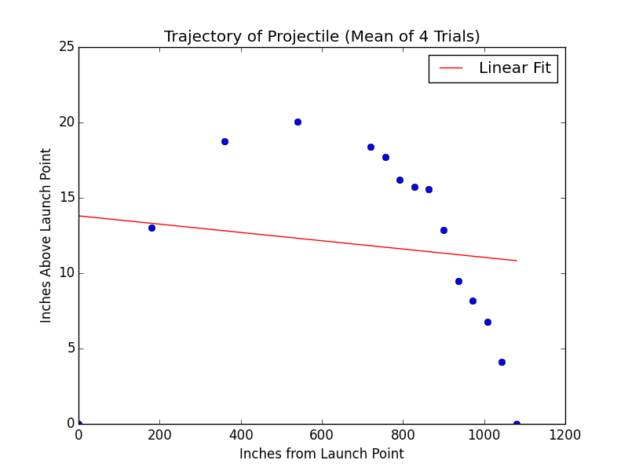
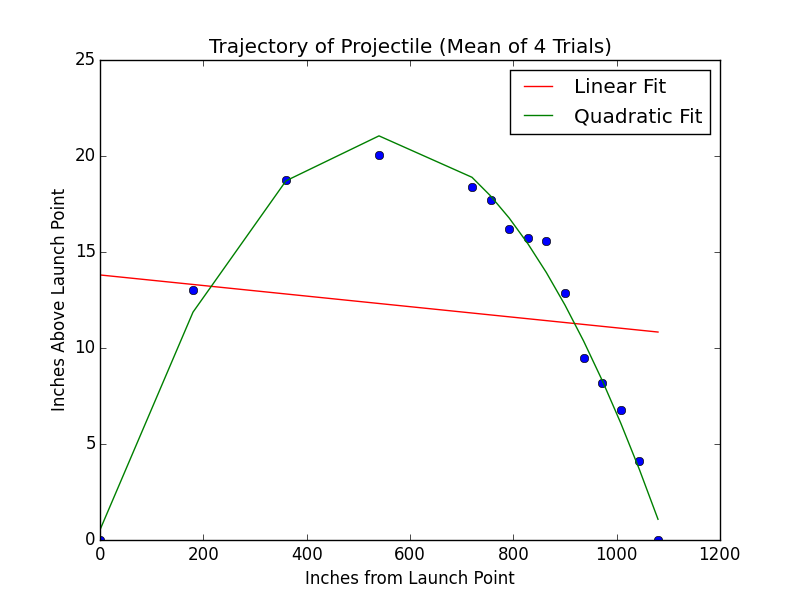
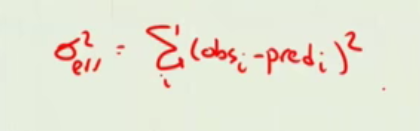
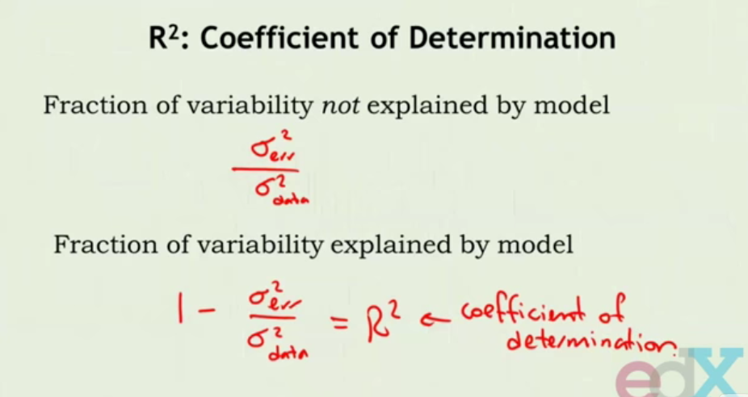
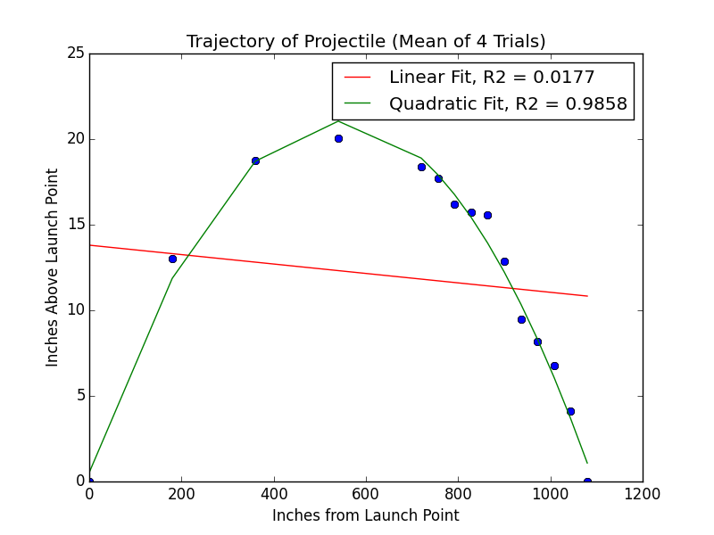

## Another Experiment

Let's assume that fire an arrow at a target. When we release the arrow, it will fly to the target. Suppose we've taken a bunch of measurements. 

We're going to be measuring the height of the arrow at various times during its flight to the target and work to fit a curve to that.

We'll also be looking into ways of measuring how well our curve is
actually fitting the data by developing some sensible mathematical measures.

Here is data:

    Distance (yds) height (ins) height height height
    30  0 0 0 0
    29 2.25 3.25 4.5 6.5
    28 5.25 6.5 6.5 8.75
    27 7.5 7.75 8.25 9.25
    26 8.75 9.25 9.5 10.5
    25 12 12.25 12.5 14.75
    24 13.75 16 16 16.5
    23 14.75 15.25 15.5 17.5
    22 15.5 16 16.6 16.75
    21 17 17 17.5 19.25
    20 17.5 18.5 18.5 19
    15 19.5 20 20.25 20.5
    10 18.5 18.5 19 19
    5 13 13 13 13
    0 0 0 0 0

As before, we have a procedure that helps us get the data out of the data file and put it into a bunch of lists.

```python
import pylab, random

def getTrajectoryData(fileName):
    dataFile = open(fileName, 'r')
    distances = []
    heights1, heights2, heights3, heights4 = [],[],[],[]
    discardHeader = dataFile.readline()
    for line in dataFile:
        d, h1, h2, h3, h4 = line.split()
        distances.append(float(d))
        heights1.append(float(h1))
        heights2.append(float(h2))
        heights3.append(float(h3))
        heights4.append(float(h4))
    dataFile.close()
    return (distances, [heights1, heights2, heights3, heights4])

```

To do the curve fitting, here we have tryFits, which is very much like the routines we've written before.

We're converting the distances which were in yards into feet (* 36).

Then we're going to process the four measurements from each of the experiments into one average measurement for the height at that distance.

And we're going to use polyfit as we have before to do a linear fit to see if there is a linear relationship between the distance this arrow has flown and its height above the target.

```python
def tryFits(fName):
    distances, heights = getTrajectoryData(fName)
    distances = pylab.array(distances)*36
    totHeights = pylab.array([0]*len(distances))
    for h in heights:
        totHeights = totHeights + pylab.array(h)
    pylab.title('Trajectory of Projectile (Mean of 4 Trials)')
    pylab.xlabel('Inches from Launch Point')
    pylab.ylabel('Inches Above Launch Point')
    meanHeights = totHeights/float(len(heights))
    pylab.plot(distances, meanHeights, 'bo')
    a,b = pylab.polyfit(distances, meanHeights, 1)
    altitudes = a*distances + b
    pylab.plot(distances, altitudes, 'r',
               label = 'Linear Fit')
    pylab.legend()

tryFits('launcherData.txt')
pylab.show()

```

Here's a linear fit of a line to that data:



You can just see that this linear fit seems to really bear no relationship at all to the actual data points.

So let's go back to our code, and let's try a parabolic fit.

```python
def tryFits(fName):
    distances, heights = getTrajectoryData(fName)
    distances = pylab.array(distances)*36
    totHeights = pylab.array([0]*len(distances))
    for h in heights:
        totHeights = totHeights + pylab.array(h)
    pylab.title('Trajectory of Projectile (Mean of 4 Trials)')
    pylab.xlabel('Inches from Launch Point')
    pylab.ylabel('Inches Above Launch Point')
    meanHeights = totHeights/float(len(heights))
    pylab.plot(distances, meanHeights, 'bo')
    a,b = pylab.polyfit(distances, meanHeights, 1)
    altitudes = a*distances + b
    pylab.plot(distances, altitudes, 'r',
               label = 'Linear Fit')
    a,b,c = pylab.polyfit(distances, meanHeights, 2)
    altitudes = a*(distances**2) + b*distances + c
    pylab.plot(distances, altitudes, 'g',
               label = 'Quadratic Fit')
    pylab.legend()

tryFits('launcherData.txt')
pylab.show()

```



The jaggedness comes from the fact that we're just simply plotting the parabola only at the data points at which we actually had measurements.

This curve here actually looks like it fits the data pretty well.

**But how do we measure the goodness of a fit?** 

Is there some mathematical analysis we can do that would reveal that the line is a lousy predictor of the observations, whereas the parabola is a much better predictor?

---

## Measuring the "goodness" of a fit

Let's start by talking about a measure of the size of the errors. 

How much are the errors varying? 

How much are we varying from the mean? 

Are the errors pretty much all the same, or are they big, or are they small?

The standard measure of variability is the **variance**

This is, in fact, just exactly the least squares, which is the difference between the observation and the prediction, and we take the sum of the square of those errors over the whole thing. And a normalization constant.



That would give us a sense of how much the errors vary. So if there was small errors all around, then in fact, the variance of the errors would be small.

But the trouble is that if we're making observations in terms of parse x, the errors may be smaller in parse x, but as an absolute value, the errors are huge.

So we need to compare the variability of the errors to the variability of the original data. 

So we want to make a ratio of those two quantities, to get a sense of how well the model is fitting the data.



So when the coefficient of determination is close to 1, that means that the model is doing a good job of explaining the data, and when the coefficient of determination is very small, close to 0, that means that there's not much of a match at all between the model and the data.

We never expect r squared to be 1, because that would mean we had no error at all.

---

Let's put this observation into some code.

we've written a procedure that will compute the r squared value given a set of measurements and a set of predicted values.

```python
def rSquare(measured, estimated):
    """measured: one dimensional array of measured values
       estimate: one dimensional array of predicted values"""
    SEE = ((estimated - measured)**2).sum()
    mMean = measured.sum()/float(len(measured))
    MV = ((mMean - measured)**2).sum()
    return 1 - SEE/MV

```

And here we modified tryFits, and calculated the r squared value for each of the two fits, and put that on our plot.

```python
def tryFits1(fName):
    distances, heights = getTrajectoryData(fName)
    distances = pylab.array(distances)*36
    totHeights = pylab.array([0]*len(distances))
    for h in heights:
        totHeights = totHeights + pylab.array(h)
    pylab.title('Trajectory of Projectile (Mean of 4 Trials)')
    pylab.xlabel('Inches from Launch Point')
    pylab.ylabel('Inches Above Launch Point')
    meanHeights = totHeights/float(len(heights))
    pylab.plot(distances, meanHeights, 'bo')
    a,b = pylab.polyfit(distances, meanHeights, 1)
    altitudes = a*distances + b
    pylab.plot(distances, altitudes, 'r',
               label = 'Linear Fit' + ', R2 = '
               + str(round(rSquare(meanHeights, altitudes), 4)))
    a,b,c = pylab.polyfit(distances, meanHeights, 2)
    altitudes = a*(distances**2) + b*distances + c
    pylab.plot(distances, altitudes, 'g',
               label = 'Quadratic Fit' + ', R2 = '
               + str(round(rSquare(meanHeights, altitudes), 4)))
    pylab.legend()

tryFits1('launcherData.txt')
pylab.show()

```



The plot is exactly the same as before, except that we've reported the r squared value for each of the two models.


