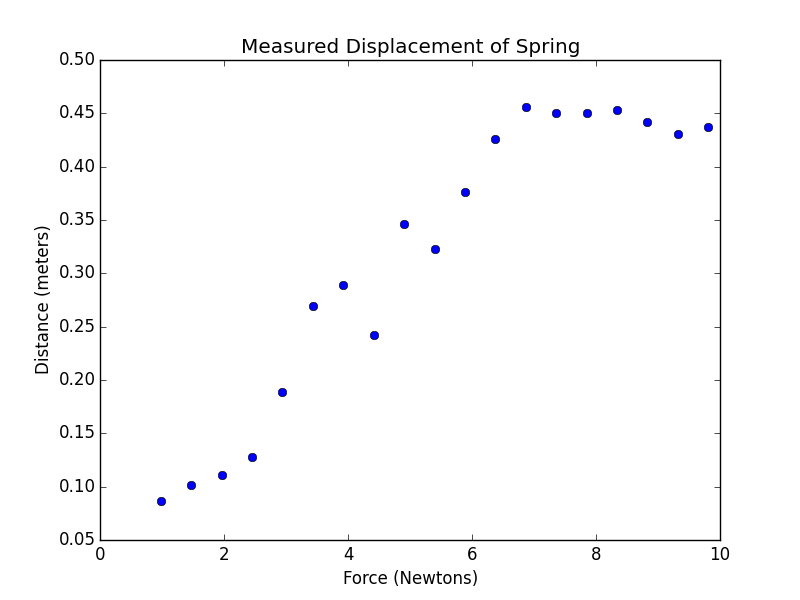
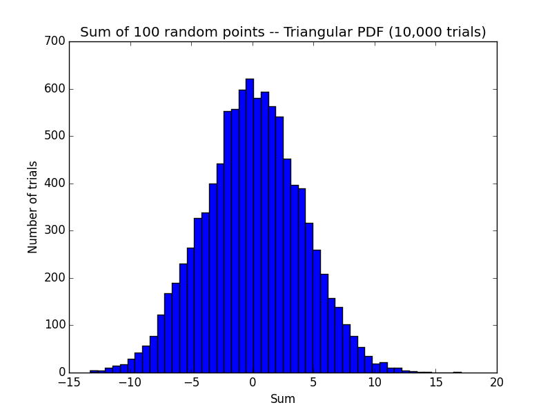
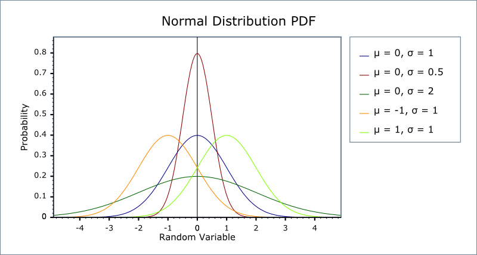
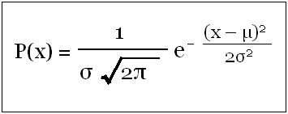

# Lecture 7 - Curve Fitting

Our goal in this lecture is to study how computation can help us understand our experimental data and process it to help reveal the underlying truths.

### A common pattern in Science and Engineering

1. develop a hypothesis

2. design an experiment, take measurements

3. use computation to

	a. evaluate hypothesis
	b. determine values of unknown 
	c. predict consequences

---

Let's see how this might work in practice.

Assume that we designed an experiment to test Hook’s law for springs ( F= - KX )

Here is our measurements :

    Distance (m) Mass (kg)
    0.0865		0.1
    0.1015		0.15
    0.1106		0.2
    0.1279		0.25
    0.1892		0.3
    0.2695		0.35
    0.2888		0.4
    0.2425		0.45
    0.3465		0.5
    0.3225		0.55
    0.3764		0.6
    0.4263		0.65
    0.4562		0.7
    0.4502		0.75
    0.4499		0.8
    0.4534		0.85
    0.4416		0.9
    0.4304		0.95
    0.4370		1.0
    

A good first step whenever we're trying to figure out what's up with our data is to plot it, to look at it visually.

Here's a couple Python procedures to help us do that.

```python
import pylab, random

# read the data in from a text file where we've entered the data.
def getData(fileName):
    dataFile = open(fileName, 'r')
    distances = []
    masses = []
    discardHeader = dataFile.readline()
	# Reads the first line of the file which is heared and discard it.
	# Each line comes in as a string. 
	# we're going to take that string and split it into substrings that correspond to the non blank portions of the line.

    for line in dataFile:
        d, m = line.split()
		# d: Distance Measurement
		# m: Mass Measurement
		distances.append(float(d))
        masses.append(float(m))
    dataFile.close()
    return (masses, distances)
```
```python
def plotData(fileName):
    xVals, yVals = getData(fileName)
	
	# convert data into the pylab array data type, a very handy data type for doing numerical manipulation.
    xVals = pylab.array(xVals)
    yVals = pylab.array(yVals)
    
	xVals = xVals*9.81 # convert mass to force (F = mg)
    pylab.plot(xVals, yVals, 'bo', label = 'Measured displacements')
    pylab.title('Measured Displacement of Spring')
    pylab.xlabel('Force (Newtons)')
    pylab.ylabel('Distance (meters)')

plotData('springData.txt')
pylab.show()
```
Here are the results:



But we expected all the measured points to fall on a line with slope 1/k.

So, there was clearly some errors that crept in.

Let's see how that might affect our experiment. We want to model errors as random numbers.

---

Basically, the errors will lie in the range between +1 and -1. The idea is that the errors are much more likely to be small than they are to be large and close to one.

Let's run a little experiment.

##### 1. First thing we're going to do is to draw 100 numbers from that probability distribution.

##### 2. Then we're going to sum them up.

each one of those numbers that we draw will represent a small error from some random source.
And it's really the cumulative effect of all those errors that we'll want to do. So we're going to sum them.

obviously the smallest value we should get should be -100. And at the other extreme, we might get something as big as +100 as the sum.

We're actually going to see what the distribution looks like.

##### 3. Having done that particular sum, we'll save it away in a histogram and repeat 10,000 times.

So we're going to build a histogram of what all the sums look like.

Let's write a little program and see what the results look like.

```python
def testErrors(ntrials=10000,npts=100):
    results = [0] * ntrials
    for i in xrange(ntrials):
        s = 0   # sum of random points
        for j in xrange(npts):
            s += random.triangular(-1,1)
        results[i] =s
    # plot results in a histogram
    pylab.hist(results,bins=50)
    pylab.title('Sum of 100 random points -- Triangular PDF (10,000 trials)')
    pylab.xlabel('Sum')
    pylab.ylabel('Number of trials')

##testErrors()
##pylab.show()

```
What testErrors does is, for the number of trials that we've asked for, in this case the default value for trials is 10,000, it will go off and
select a certain number of points, in this case 100, from a particular probability distribution, in this case a triangular distribution that goes
between -1 and 1.

And here are the results:



The result is that the probability of all of our sum of the errors converges on the normal distribution as the number of trials in our experiment increases.

Another observation that comes to us courtesy of the central limit theorem. And that basically tell us that we get the same result no matter what error
distribution that we choose.

We chose a triangular distribution, but we could have chosen a uniform distribution, or a Gaussian distribution, or, in fact, any distribution that has a finite mean and variance.

## The Normal Distribution



The distribution is completely characterized by two parameters:

- One of the parameters is the mean. And that's the central axis of the distribution, in this case, we're plotting normal distributions with a mean of 0.

- The other measurement is the variance, which is a measure of the width of the curve.

With those two factors in hand, we can actually write a little equation that describes the PDF, the Probability Density Function, for a normal distribution.



There's some special names we apply. If mu is equal to 0 and the variance is equal to 1, we call that the unit normal or maybe the **standard normal distribution**.

From the equasion, you can see If the argument x gets bigger, the probability associated with that becomes exponentially smaller.

So when our observation errors are due to the accumulation of many small random processes perturbing the measurements ever so slightly, we can say something about the likelihood that the error will be of a certain size.

It tells us that large errors are basically much less likely, I mean, exponentially less likely,
than small errors.