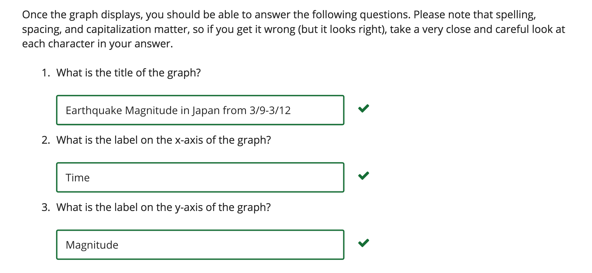

# Problem Set 1

### NUMPY AND PYLAB  (3/3 points)

To create plots you will need the Python library packages Matplotlib (Pylab) and NumPy. If you downloaded Enthought Canopy, you should already have these packages installed.

To test that you have successfully installed matplotlib and numpy, download and unzip [ProblemSet1.zip](./ProblemSet1.zip "ProblemSet1.zip") then open the file run_pkgtest.py and run it. A graph should appear after a short pause (it may take a few minutes, depending on the speed of your machine); when it does, please answer the questions at the bottom of this page related to the graph's appearance.

If you see an error such as:

    Traceback (most recent call last):
      File "C:/Users/winedx9/Desktop/run_pkgtest.py", line 1, in <module>
        import ps1_pkgtest
      File "ps1_pkgtest.py", line 2, in <module>
    ImportError: No module named numpy
    and/or

Traceback (most recent call last):

      File "C:/Users/winedx9/Desktop/run_pkgtest.py", line 1, in <module>
        import ps1_pkgtest
      File "ps1_pkgtest.py", line 3, in <module>
    ImportError: No module named pylab

then you do not have the required packages installed. Read on for more support.

- If you **do** have Enthought installed, be sure the top of your IDLE interpreter says something like Python 2.7.6 | 64-bit | (default, Jan 29 2014, 17:03:59) [MSC v.1500 64 bit (AMD64)] on win32. If it doesn't say anything like this, you are not running the IDLE interpreter from the Enthought distribution. Find the Enthought folder on your system and choose IDLE from within the Enthought folder.

- If you **did not** install Enthought, you can attempt to install the correct packages on your own. Note that the 6.00.2x staff will not be able to help you install these packages. If you have trouble, we strongly recommend you simply install Canopy. That said, here are the packages you need to have. Choose which set of instructions to follow based on which OS and version of Python you are running. You only need the one of each library that matches your setup!

