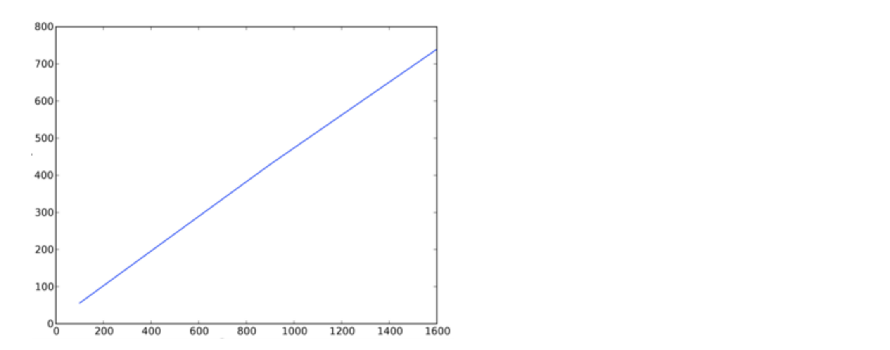
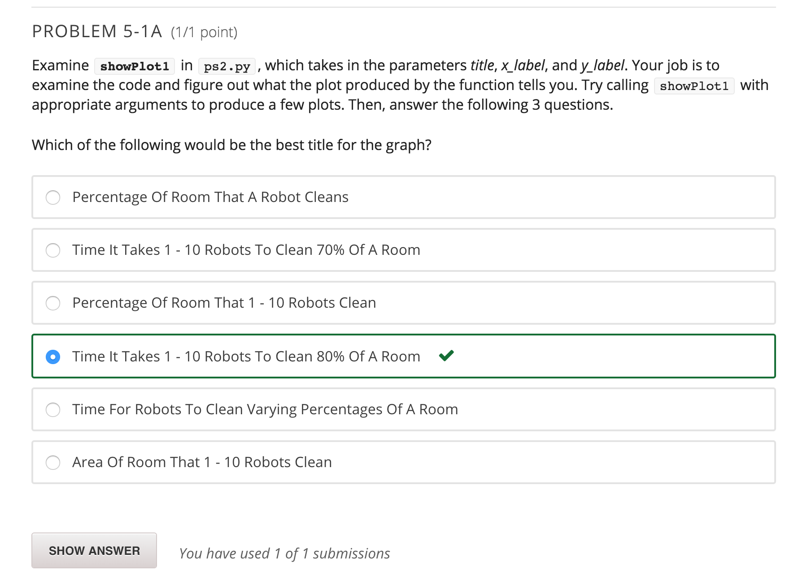
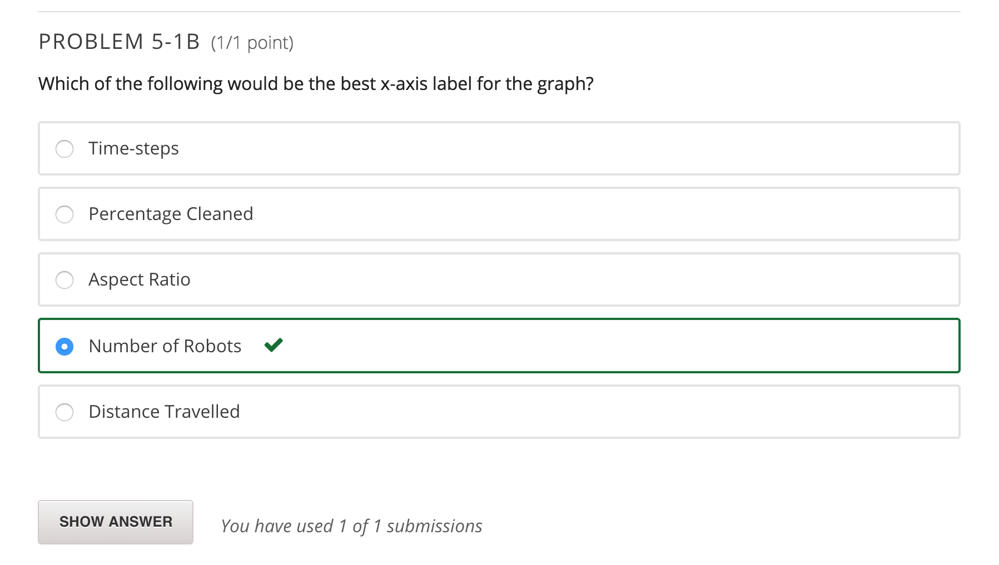
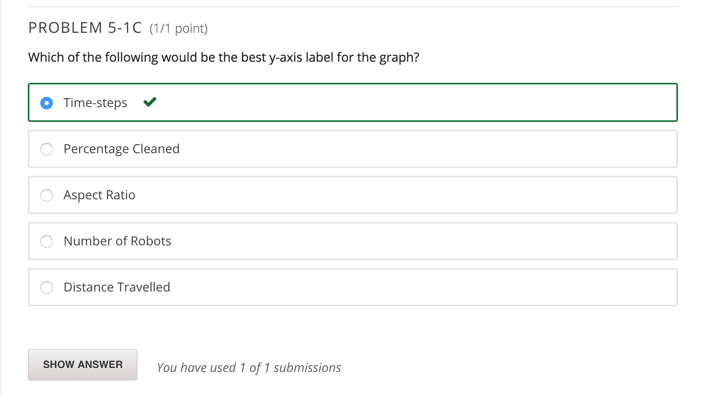
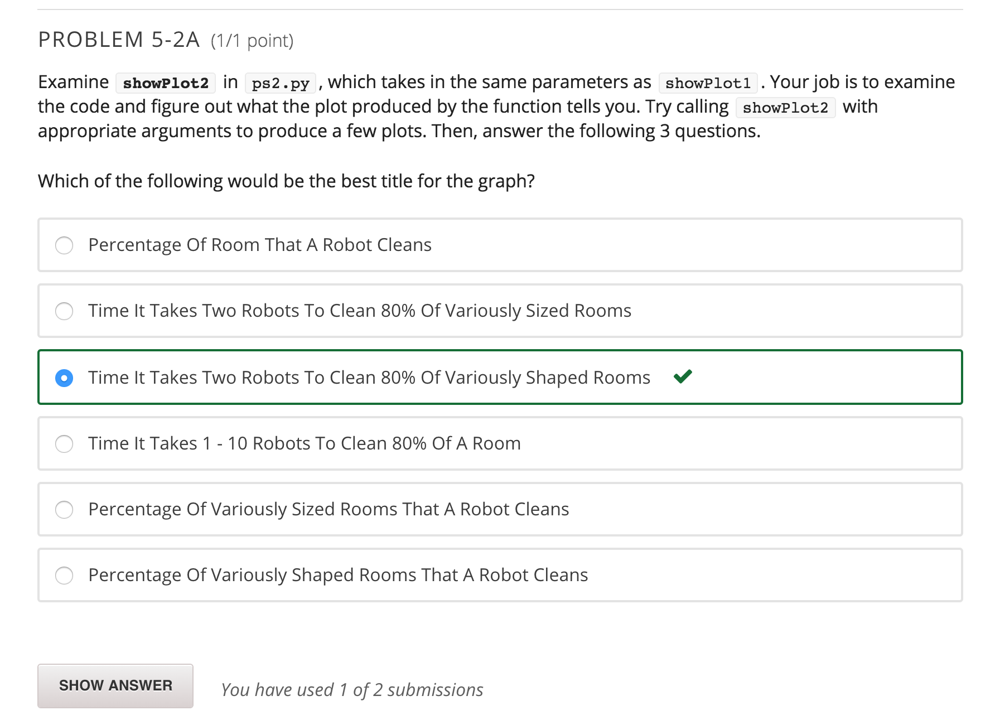
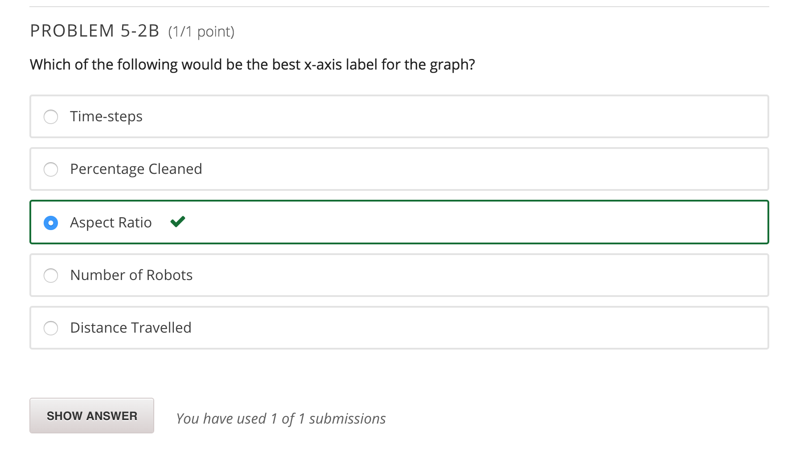
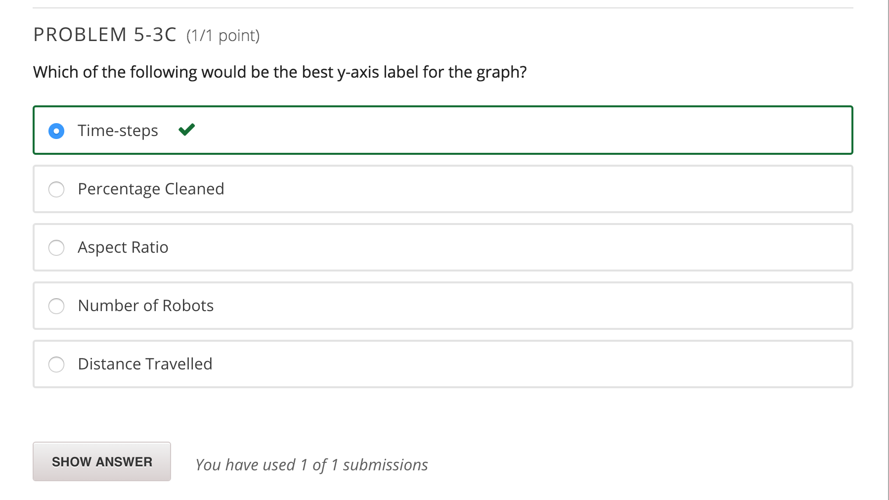

Now, you'll use your simulation to answer some questions about the robots' performance.

In order to do this problem, you will be using a Python tool called PyLab. 

Below is an example of a plot. This plot does not use the same axes that your plots will use; it merely serves as an example of the types of images that the PyLab package produces.

Note to those who did the optional visualization: For problem 5, we make calls to runSimulation() to get simulation data and plot it. However, you don't want the visualization getting in the way. If you chose to do the visualization exercise, before you get started on problem 5 (and before you submit your code in submission boxes), make sure to comment the visualization code out of runSimulation(). There should be 3 lines to comment out. If you do not comment these lines, your code will take a REALLY long time to run!!

For the questions below, call the given function with the proper arguments to generate a plot using PyLab.

