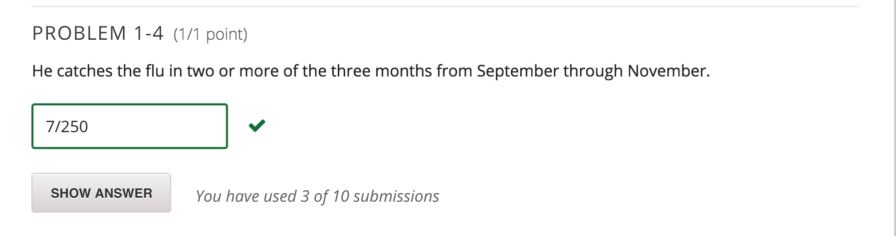

### PART A - PROBLEM 1: PROBABILITIES

This part of the problem set involves some pencil-and-paper exercises. It will help you practice and understand simple probability and statistics.

Let's say Alvin will catch the flu with probability of 1/10 during any given month. Let's also assume that Alvin can catch the flu only once per month, and that if he has caught the flu, the flu virus will die by the end of the month. What is the probability of the following events?

As in the problems from Lecture 3, answer each question in reduced fraction form - eg 1/5 instead of 2/10.

