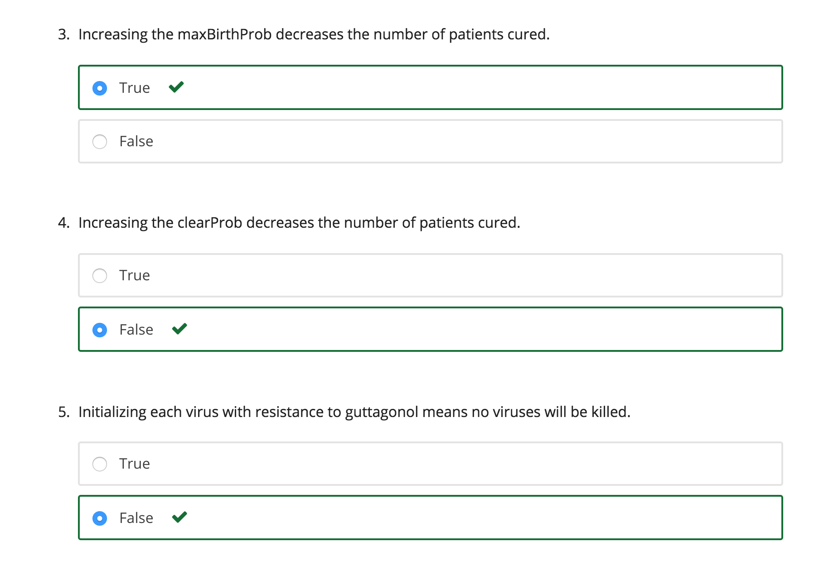

### PART A - THE EFFECT OF DELAYING TREATMENT ON PATIENT DISEASE

In this part, we explore the effect of delaying treatment on the ability of the drug to eradicate the virus population. You will need to run multiple simulations to observe trends in the distributions of patient outcomes.

Note: In this problem set, you will be asked to answer multiple choice questions. Double check how many attempts you have on each problem before answering.

In Problem 5 of the last problem set you ran a simulation that consists of 150 time steps, followed by the addition of the drug, guttagonol, followed by another 150 time steps. Run the same simulation as in Problem 5 in Problem Set 3 but this time for 300, 150, 75, and 0 time steps before administering guttagonol to the patient. Then, run the simulation for an additional 150 time steps. Use the same initialization parameters for ResistantVirus and TreatedPatient as you did for Problem 5 of Problem Set 3.

Use the following parameters to initialize a TreatedPatient:

- viruses, a list of 100 ResistantVirus instances

- maxPop, maximum sustainable virus population = 1000

Each ResistantVirus instance in the viruses list should be initialized with the following parameters:

- maxBirthProb, maximum reproduction probability for a virus particle = 0.1

- clearProb, maximum clearance probability for a virus particle = 0.05

- resistances, The virus's genetic resistance to drugs in the experiment = {'guttagonol': False}

- mutProb, probability of a mutation in a virus particle's offspring = 0.005

For each of these 4 conditions, repeat the experiment for enough trials to gain reasonable insight into the expected result. Rather than averaging the final virus population across different trials as in the last pset, this time use pylab's hist() function to plot a histogram of the final virus populations under each condition for each trial. You may also find pylab's subplot function to be helpful. The x-axis of the histogram should be the final total virus population values (choose x axis increments or "histogram bins" according to the range of final virus population values you get by running the simulation multiple times). Then, the y-axis of the histogram should be the number of trials belonging to each histogram bin. You should decide the number of trials you ran for each condition in order to obtain a reasonable distribution. 

Fill in the function simulationDelayedTreatment(numTrials) to perform this simulation. Feel free to break down the problem into smaller subparts and define helper functions for each.

Create four histograms (one for each condition of 300, 150, 75, and 0 time step delays). Then, answer the following questions:

