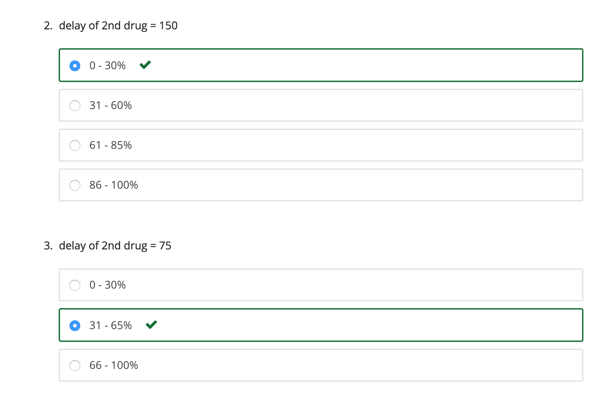

### PART B - DESIGNING A TREATMENT PLAN WITH TWO DRUGS

One approach to addressing the problem of acquired drug resistance is to use cocktails – administration of multiple drugs that act independently to attack the virus population.

In this problem, we use two independently-acting drugs to treat the virus. We will use this model to decide the best way of administering the two drugs. Specifically, we examine the effect of a lag time between administering the first and second drugs on patient outcomes.

Use the following parameters to initialize a TreatedPatient:

- viruses, a list of 100 ResistantVirus instances.

- maxPop, maximum sustainable virus population = 1000

Each ResistantVirus instance in the viruses list should be initialized with the following parameters:

- maxBirthProb, maximum reproduction probability for a virus particle = 0.1

- clearProb, maximum clearance probability for a virus particle = 0.05

- resistances, the virus’s genetic resistance to drugs in the experiment: {'guttagonol': False, 'grimpex': False}

- mutProb, probability of a mutation in a virus particle’s offspring = 0.005

Run the simulation for 150 time steps before administering guttagonol to the patient. Then run the simulation for 300, 150, 75, and 0 time steps before administering a second drug, grimpex, to the patient. Finally, run the simulation for an additional 150 time steps.

For each of these 4 conditions, repeat the experiment for enough trials to get a reasonable condition, while recording the final virus populations. Use pylab’s hist() function to plot a histogram of the final total virus populations under each condition.

Fill in the function simulationTwoDrugsDelayedTreatment(numTrials) to perform this simulation. Feel free to break down the problem into smaller subparts and define helper functions for each.

Create 4 histograms (for 300, 150, 75, and 0 time steps) and then answer the following set of questions.

