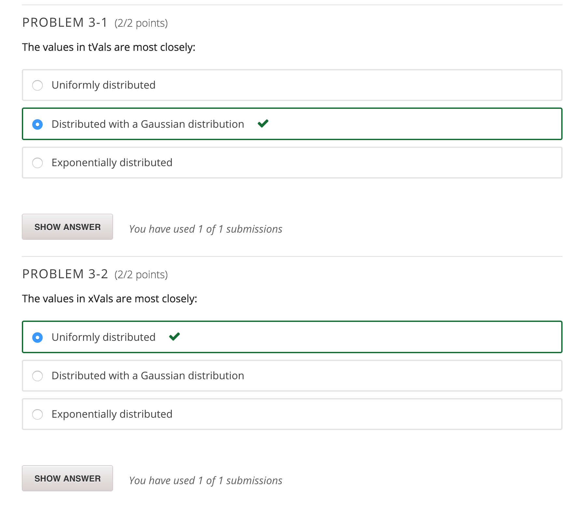
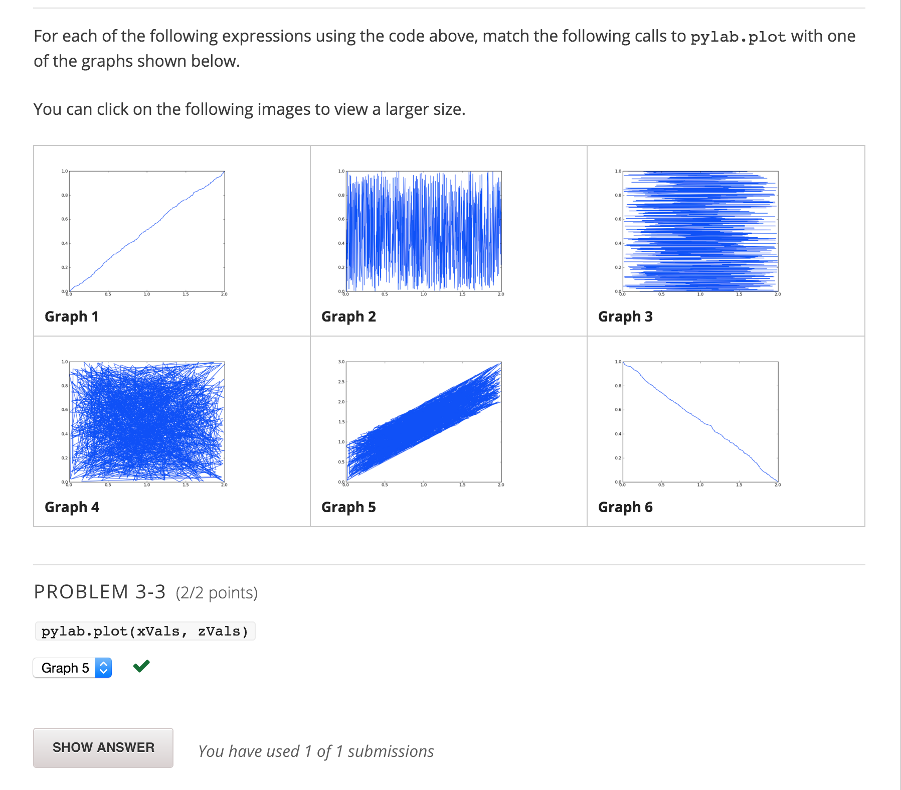
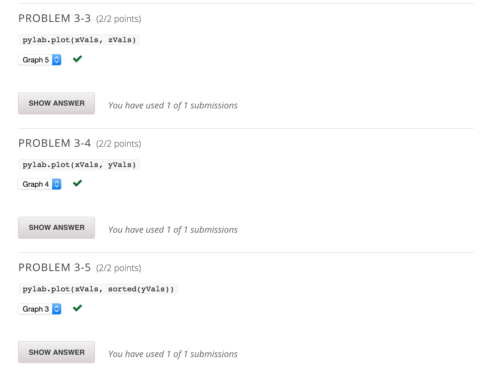
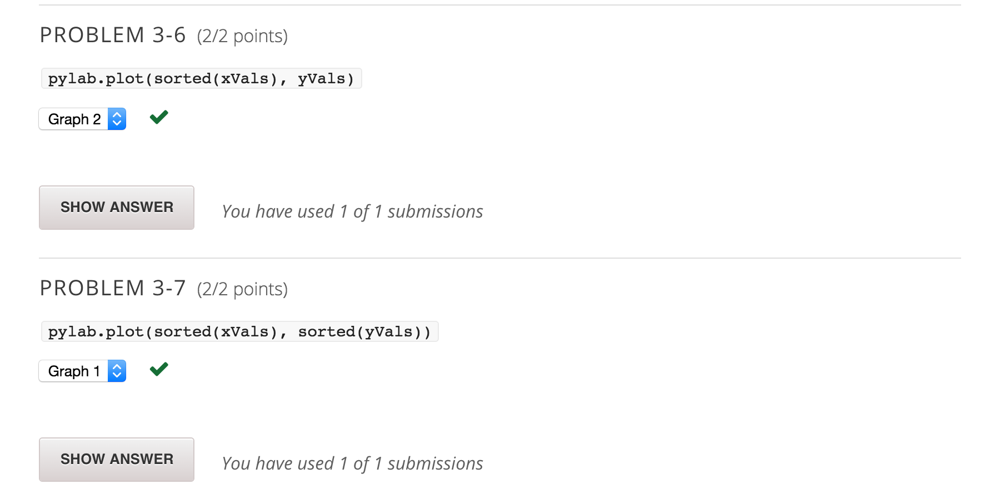

Consider the following code:

import random, pylab
xVals = []
yVals = []
wVals = []
for i in range(1000):
    xVals.append(random.random())
    yVals.append(random.random())
    wVals.append(random.random())
xVals = pylab.array(xVals)
yVals = pylab.array(yVals)
wVals = pylab.array(wVals)
xVals = xVals + xVals
zVals = xVals + yVals
tVals = xVals + yVals + wVals
For each of the following questions, select the best answer from the set of choices.

---

### PROBLEM 3-1  (2/2 points)

The values in tVals are most closely:

