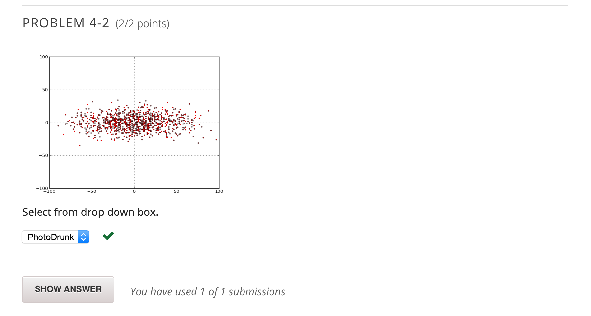

In lecture, we explored the concept of a random walk, using a set of different models of drunks. Below is the code we used for locations and fields and the base class of drunks – you should not have to study this code in detail, since you have seen it in lecture.

### CODE FROM LECTURE

[Click to see the Location, Field, and Drunk classes from lecture](./Quiz - 4.py "Click to see the Location, Field, and Drunk classes from lecture")

### NEW CODE

The following function is new, and returns the actual x and y distance from the start point to the end point of a random walk.

    def walkVector(f, d, numSteps):
        start = f.getLoc(d)
        for s in range(numSteps):
            f.moveDrunk(d)
        return(f.getLoc(d).getX() - start.getX(),
               f.getLoc(d).getY() - start.getY())
     

### DRUNK VARIATIONS

Here are several different variations on a drunk.

    class UsualDrunk(Drunk):
        def takeStep(self):
            stepChoices =\
                [(0.0,1.0), (0.0,-1.0), (1.0, 0.0), (-1.0, 0.0)]
            return random.choice(stepChoices)
    
    class ColdDrunk(Drunk):
        def takeStep(self):
            stepChoices =\
                [(0.0,0.9), (0.0,-1.03), (1.03, 0.0), (-1.03, 0.0)]
            return random.choice(stepChoices)
    
    class EDrunk(Drunk):
        def takeStep(self):
            ang = 2 * math.pi * random.random()
            length = 0.5 + 0.5 * random.random()
            return (length * math.sin(ang), length * math.cos(ang))
    
    class PhotoDrunk(Drunk):
        def takeStep(self):
            stepChoices =\
                        [(0.0, 0.5),(0.0, -0.5),
                         (1.5, 0.0),(-1.5, 0.0)]
            return random.choice(stepChoices)
    
    class DDrunk(Drunk):
        def takeStep(self):
            stepChoices =\
                        [(0.85, 0.85), (-0.85, -0.85),
                         (-0.56, 0.56), (0.56, -0.56)] 
            return random.choice(stepChoices)
    

### PROBLEM

Suppose we use a Monte Carlo simulation to simulate a random walk of a class of drunk, returning a collection of actual distances from the origin for a set of trials.

Each graph below was generated by using one of the above five classes of a drunk (UsualDrunk, ColdDrunk, EDrunk, PhotoDrunk, or DDrunk). For each graph, indicate which Drunk class is mostly likely to have resulted in that distribution of distances. Click on each image to see a larger view.

