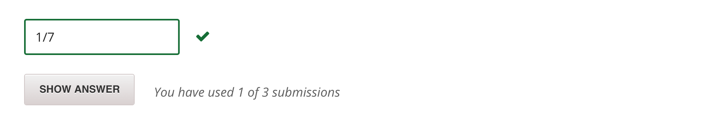

### PROBLEM 5-1  (4/4 points)

You have a bucket with 4 red balls and 4 green balls. You draw 3 balls out of the bucket. Assume that once you draw a ball out of the bucket, you don't replace it. What is the probability of drawing 3 balls of the same color?

As in the finger exercise problems from Lecture 3, answer the question in reduced fraction form - eg 1/5 instead of 2/10.



---

### PROBLEM 5-2  (16/16 points)

Write a Monte Carlo simulation to solve the above problem. Feel free to write a helper function if you wish.

    def drawing_without_replacement_sim(numTrials):
        '''
        Runs numTrials trials of a Monte Carlo simulation
        of drawing 3 balls out of a bucket containing
        4 red and 4 green balls. Balls are not replaced once
        drawn. Returns a float - the fraction of times 3 
        balls of the same color were drawn in the first 3 draws.
        '''
        # Your code here 

Paste your entire function (including the definition) in the box.

Restrictions:

- Do not import or use functions or methods from pylab, numpy, or matplotlib.

- Do not leave any debugging print statements when you paste your code in the box.

- For this question, you will not be able to see the test cases we run. This problem will test your ability to come up with your own test cases.

```python
# Paste your code here
import random

def sameColor(balls):
    # balls: a list containing 3 string
    # returns True if all items are "G" or all are "R"
    GreenBalls = 0
    RedBalls = 0
    for b in balls:
        if b == "G":
              GreenBalls += 1
        elif b == "R":
            RedBalls += 1
    if GreenBalls == 3 or RedBalls == 3:
        return True
    else:
        return False  
                      
def draw3Balls():
    bucket = ["G","G","G","G","R","R","R","R"]
    balls = []
    for i in range(3):
        ball = random.choice(bucket)
        balls.append(ball)
        bucket.remove(ball)
    return balls

def drawing_without_replacement_sim(numTrials):
    '''
    Runs numTrials trials of a Monte Carlo simulation
    of drawing 3 balls out of a bucket containing
    4 red and 4 green balls. Balls are not replaced once
    drawn. Returns a float - the fraction of times 3 
    balls of the same color were drawn in the first 3 draws.
    '''
    # Your code here 
    
    totalSameColors = 0
    
    for tr in range(numTrials):
        balls = draw3Balls()
        if sameColor(balls):
            totalSameColors += 1
            
    return totalSameColors/float(numTrials)      
```

	Correct


